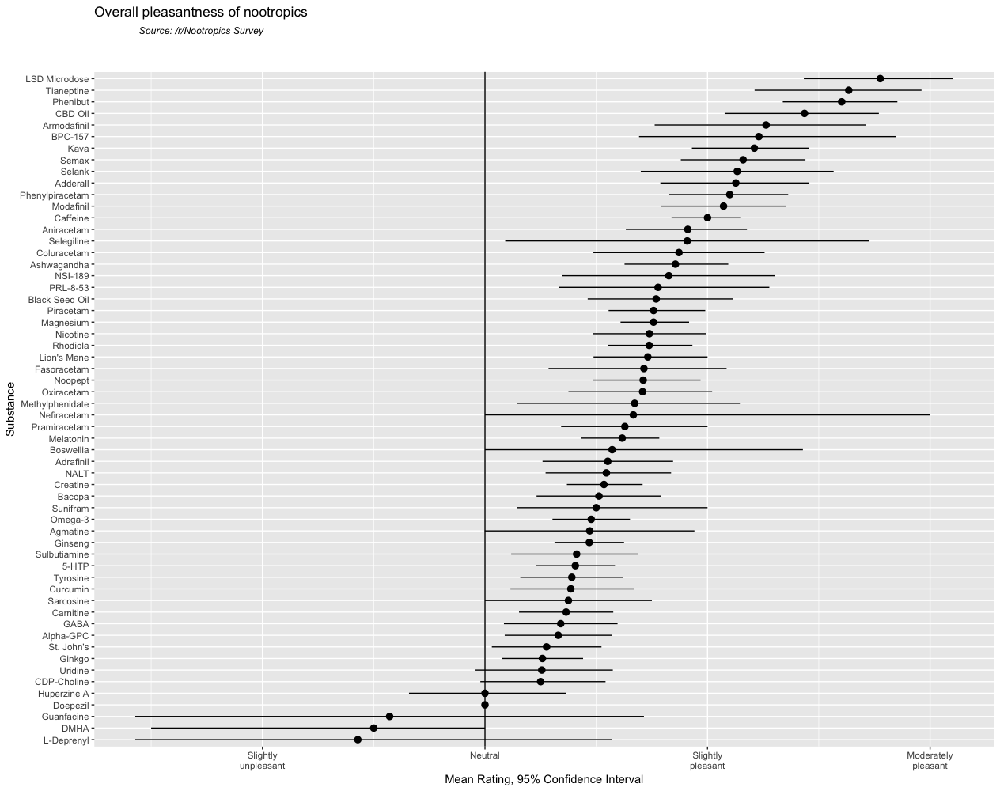
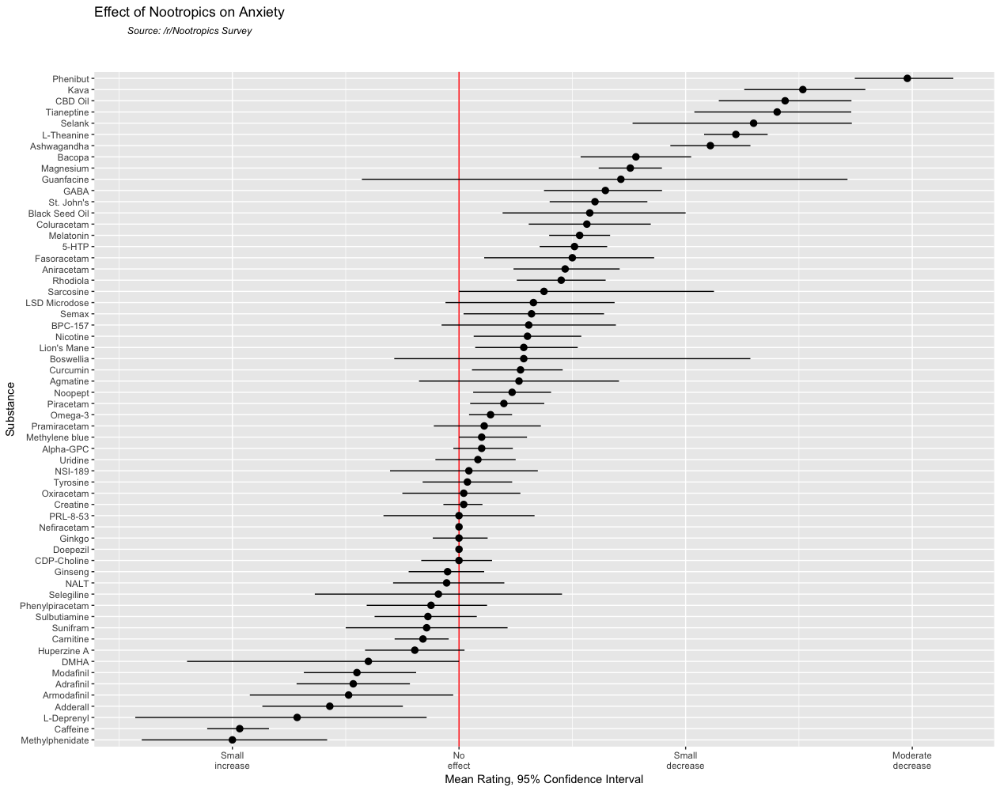
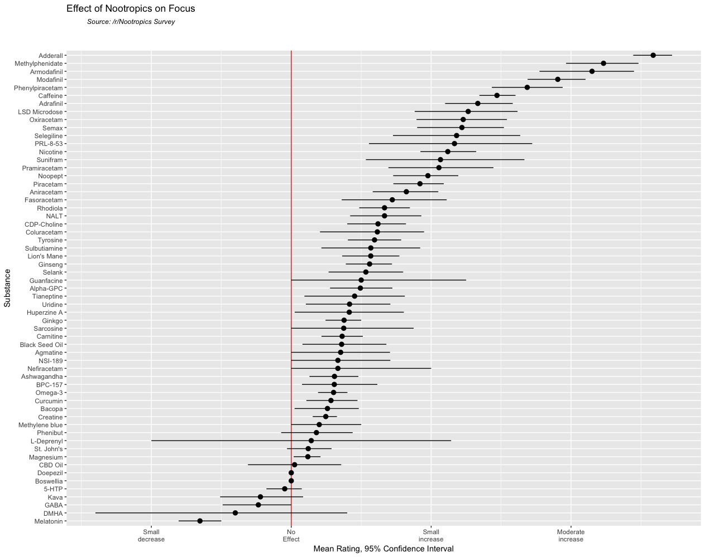
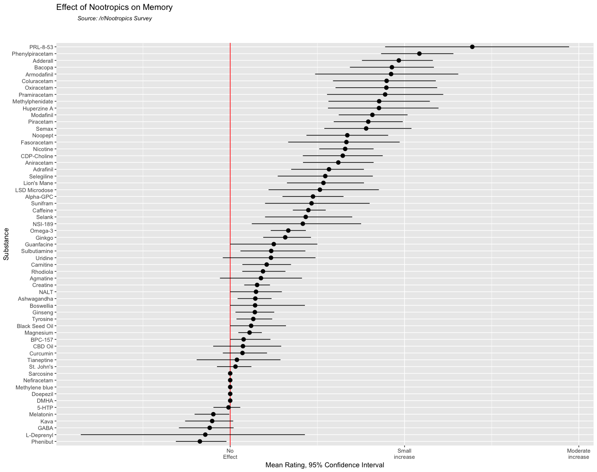

# 2017 Nootropics Survey on /r/Nootropics

# Introduction

tl;dr: most substances seem to have no or only slight effects when rated subjectively. Most substances with substantial effects were already well-known for their effects, some of them are prescription drugs or pharmaceuticals. 

## Sample Description

**Age.** The mean participant age was 26.86 years (standard deviation = 9.68, range = 12-88). 

**Gender.** From the total sample of 380 participants, 325 (91.07%) male and 29 (9.89%) female participants completed the survey. 19 did not answer and 7 chose the "other" option for gender. From those seven participants, three gave a valid response, while four answered "attack helicopter". Those three participants were either non-binary, trans-male or trans woman. The male-to-female ratio can be considered rather extreme even for Reddit standards, which was roughly 70/30 [in an analysis a couple of years ago](#)(https://www.reddit.com/r/dataisbeautiful/comments/1wtnkd/subreddit_gender_ratios_oc/) and can be compared to extremely male-dominated subreddits like /r/baseball or /r/Libertarian. 

**Country of residence.** The vast majority of participants were from English speaking countries. The table lists the top 10 most frequent responses. Other countries included Switzerland (5 participants), France (3), Italy (3),  Netherlands (3), New Zealand (3), Portugal (3) and South Africa (3).

| Country  | Frequency  |
|---|---|
| USA  | 185   |
| Not answered  | 47  |
| Canada  | 23  |
| UK  | 22  |
| Australia  | 14   |
| Germany  | 8  |
| Belgium  | 6  |
| Russia  | 6  |
| Spain  | 5  |

# Personality Scores

A brief personality inventory, [the Mini-IPIP](#)(http://ipip.ori.org/MiniIPIPKey.htm), was administered. It measures the Big Five personality traits: 

* Extraversion: This trait includes characteristics such as excitability, sociability, talkativeness, assertiveness and high amounts of emotional expressiveness. High levels of this trait are associated with more friends, higher life satisfaction and lower rates of mental disorders. 

* Agreeableness: This personality dimension includes attributes such as trust, altruism, kindness, affection, and other prosocial behaviors. This dimension is a good predictor of job choice: agreeable people tend to choose professions that involve caring and nurturing behavior and low competition, like nurse, psychotherapist, teacher, charity worker or doctor (excluding surgeons). People low in agreeableness tend to like competition and choose professions that require less compassion, like CEO, lawyer, journalist, police officer or chef. Agreeableness also predicts political views, as agreeable people tend to be liberals or leftists, while disagreeable persons are conservative or right-wingers. 

* Conscientiousness: Common features of this dimension include high levels of thoughtfulness, with good impulse control and goal-directed behaviors. Those high in conscientiousness tend to be organized and mindful of details. This trait predicts academic and job success quite well.

* Neuroticism: Individuals high in this trait tend to experience emotional instability, anxiety, moodiness, irritability, and sadness. High scores on this dimension are often, but not necessarily, associated with anxiety disorders and depression. 

* Openness: This trait features characteristics such as imagination and insight, and those high in this trait also tend to have a broad range of interests. This dimension is somewhat correlated with IQ.

The scores of this sample were compared to [a larger sample of college students](https://www.researchgate.net/profile/Frederick_Oswald/publication/7014171_The_Mini-IPIP_Scales_Tiny-yet-Effective_Measures_of_the_Big_Five_Factors_of_Personality/links/00b49529d3205d5c29000000.pdf) used to validate this personality questionnaire. 

| Dimension | Mean | SD | Interpretation |
|---|---|--- |---|
| Extraversion | 2.67 | .94 | Low |
| Agreeableness | 3.46 | .87 | Low |
| Conscientiousness | 2.99 | .81 | Low |
| Neuroticism | 2.93 | .83 | High |
| Openness | 4.03 | .73 | High |
*Means and standard deviations for the big five personality scales, interpretation (low or high) when compared to a reference sample. All differences are statistically significant with medium effect sizes*

# Nootropics: Use and Perceived EFfects

Participants were asked about their usage of 63 different nootropics. If a participant indicated that they tried a nootropic, they were asked about the perceived effects with this substance later. 

## Perceived Effects
All perceived effects were rated on seven-point scales. The following graphs summarize the results. Substances are listed on the y axis, ranging from the highest to lowest mean rating. The points indicate the mean rating for this substance. Lines indicate a 95% confidence interval (CI), thus expressing the uncertainty of the respective mean. Wider CIs indicate a greater variety of responses.
The red line indicates the neutral response labeled “no effect“. As a rule of thumb, all mean ratings with confidence intervals crossing the red line are likely to have no effect. 
If the lower (left) end of a CI is higher than e.g. the white line for “small increase“, the effects of this substance were rated quite high. This was rarely the case. Most substances had ratings somewhere between “no“ and “small effect“, with some exceptions.

### Overall Pleasantness

Most substances were rated as being somewhere between neutral and slightly pleasant, suggesting that detrimental effects are rare for nootropics. Three substances were rated as below neutral, but the confidence intervals are extremely large. On the other hand, some substances were rated as being more than “slightly“ pleasant: DMHA, Huperzine A, Selegiline and LSD. 

### Anxiety

According to the responses, anxiety is reduced most effectively by the following substances: L-Theanine, Tianeptine, CBD, Kava and Phenibut. All of these substances are well known for there anxiolytic, calming effects. On the other hand, anxiety is slightly increased by a number of well-known stimulants, like methylphenidate, caffeine, adderall and the finil group. 

### Focus

The most profound effects on focus were reported for Adrafinil, Caffeine, Phenylpiracetam, Modafinil, Armodafinil, Methylphenidate and, most of all, Adderall. Melatonin and GABA seem to decrease focus, but only very slightly. 

### Memory

Not many substances seem to improve memory. In fact, none of them were rated as leading to more than a “small increase“ in memory. 

### Motivation

A number of substances were rated as motivating. Most of them were stimulants. Melatonin, Bacopa monnieri and GABA seem to have slight detrimental effects on motivation. 

###  Mood

LSD, Tianeptine, Phenibut and Adderall seem to improve mood. Remarkably, LSD microdoses were rated as having effects comparable to Tianeptine, which is an antidepressant. 

## Nootropics Dose

Participants asked for the dose in milligrams of the nootropics they have already taken. Most of them managed to answer in the required format. Minimum, average and maximum doses for all substances are listed in the table below.

|Substance|Min|Median|Max|
|---|---|---|---|
|L-Theanine|100|200|400|
|Bacopa|200|300|500|
|Caffeine|80|200|800|
|Curcumin|100|500|2500|
|Ashwagandha|300|500|1200|
|Rhodiola|50|300|700|
|St. John’s Wort|250|575|900|
|Kava|NA|NA|NA|
|Methylphenidate|10|20|200|
|Adderall|5|25|60|
|L-Deprenyl|10|10|10|
|Tyrosine|250|600|9000|
|NALT|60|500|500|
|Creatine|1250|5000|10000|
|CDP-Choline|150|300|2000|
|Alpha-GPC|125|300|1200|
|Carnitine/NALC|500|500|1000|
|Omega-3|300|1375|5000|
|Magnesium|100|300|1000|
|Modafinil|5|125|600|
|Armodafinil|75|150|150|
|Adrafinil|50|450|900|
|Piracetam|200|3100|8000|
|Phenylpiracetam|75|160|275|
|Aniracetam|90|800|2400|
|Oxiracetam|600|800|1500|
|Pramiracetam|100|700|1600|
|Coluracetam|15|55|200|
|Fasoracetam|100|22.5|60|
|Nefiracetam|250|250|250|
|Noopept|10|15|20|
|Semax|.1|.6|2|
|Selank|.1|.25|2|
|Doepezil|1|1|1|
|Huperzine A|.085|1|5|
|Tianeptine|10|33|150|
|NSI-189|5|40|100|
|Melatonin|.05|3|30|
|GABA|100|175|250|
|5-HTP|5|125|200|
|Black Seed Oil|30|265|500|
|Ginseng|50|325|600|
|Ginkgo|60|120|250|
|Nicotine|1|4|36|
|Sulbutiamine|200|500|1500|
|Uridine|10|250|600|
|Sacrosine|2000|2000|2000|
|Sunifram|10|20|20|
|BPC-157|.01|.25|200|
|Boswellia|NA|NA|NA|
|Guanfacine|2|2|2|
|DMHA|150|150|150|
|LSD Microdose|.00005|10|25|
|CBD Oil|10|25|60|
|PRL-8-53|20|20|20|
|Agmatine|50|750|2000|
|Selegiline/Deprenyl|10|10|10|
|Phenibut|150|1000|3500|
|Lion’s Mane|200|800|3000|

# Correlations

Coming soon…